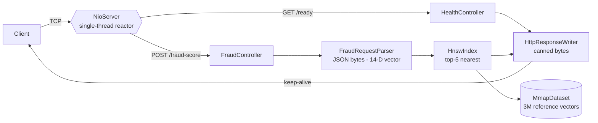

# Fraud Detection API — Rinha de Backend 2026

> Real‑time card‑fraud scoring through vector similarity search, built **by hand** on bare Java 21 — zero application frameworks, zero runtime dependencies, a single‑threaded NIO reactor, and a hot path engineered for sub‑millisecond latency.


-C71A36)


**Status:** Wave 1 complete — `POST /fraud-score` validated end‑to‑end against both official oracles. Waves 2–5 (SIMD, HNSW, containerization, GraalVM native) are on the roadmap below.

---

## Table of contents

- [The challenge](#the-challenge)
- [Approach & philosophy](#approach--philosophy)
- [Architecture at a glance](#architecture-at-a-glance)
- [Quickstart](#quickstart)
- [Verified results](#verified-results)
- [Project status & roadmap](#project-status--roadmap)
- [Repository layout](#repository-layout)
- [Documentation](#documentation)
- [Tech stack](#tech-stack)
- [Author & license](#author--license)

---

## The challenge

[Rinha de Backend](https://github.com/zanfranceschi/rinha-de-backend-2026) is a Brazilian backend performance competition. The 2026 edition (4th) is a **fraud‑detection** problem solved with **vector search**:

For every incoming card transaction, the service must:

1. Project the transaction payload into a **14‑dimensional feature vector**.
2. Find its **5 nearest neighbours** in a reference dataset of **≈3,000,000 labelled vectors**.
3. Compute `fraud_score = (fraudulent neighbours) / 5`.
4. Answer `approved = fraud_score < 0.6`.

**API** (port `9999`):

| Method | Path           | Response                                            |
| ------ | -------------- | --------------------------------------------------- |
| `GET`  | `/ready`       | `2xx` once the dataset is loaded and the server is up |
| `POST` | `/fraud-score` | `{ "approved": <bool>, "fraud_score": <float> }`     |

**Infrastructure budget (the hard part):** the *entire* solution must run within **1 CPU and 350 MB of RAM**, with **≥2 API instances** behind a round‑robin load balancer. Scoring rewards both **detection quality** (false negatives cost more than false positives; HTTP errors cost the most) and **tail latency** — a p99 ≤ 1 ms hits the score ceiling, while every 10× latency regression loses points. The reference test environment is a Late‑2014 Mac Mini (2.6 GHz, 8 GB, Ubuntu 24.04, linux‑amd64).

These constraints are the reason for every design decision in this repository.

## Approach & philosophy

| Principle | What it means here |
| --- | --- |
| **By hand** | No web framework, no JSON library, no vector‑search library. The HTTP/1.1 parser, the JSON‑to‑vector parser, the dataset loader and the k‑NN search are all hand‑rolled. The only runtime dependency is the JDK. |
| **Performance‑first** | A single‑threaded NIO reactor, off‑heap direct buffers, an allocation‑free request path (no `String`, no boxing, no intermediate objects), and pre‑computed canned responses. |
| **Measure, then optimize** | Wave 1 ships the *correct* baseline (brute‑force float32). Latency work (SIMD, HNSW, native image) is deliberately deferred to later waves so each optimization can be measured against a known‑good reference. |
| **Stable interfaces, evolving internals** | Some classes (`MmapDataset`, `HnswIndex`) are named for their *target* design. Wave 1 ships deliberately simple implementations behind those names so callers never change as the internals are upgraded across waves. This is intentional and documented — see [ARCHITECTURE.md](docs/ARCHITECTURE.md). |

## Architecture at a glance

A single thread owns a `Selector` and drives every connection through a non‑blocking, resumable state machine. Nothing blocks; nothing is allocated on the hot path.



**Component map** (`api/src/main/java/org/fraudDetection/`):

| Package | Classes | Responsibility |
| --- | --- | --- |
| `server` | `NioServer`, `ConnectionState`, `HttpParser`, `HttpResponseWriter` | Non‑blocking I/O reactor, per‑connection state, resumable byte‑level HTTP/1.1 parsing, pre‑built responses |
| `json` | `FraudRequestParser` | Walks the POST body byte‑by‑byte and fills the 14‑D query vector — no `String`, no `Map`, no regex |
| `dataset` | `MmapDataset` | Loads the ≈3M reference vectors (Wave 1: streaming heap loader) |
| `knn` | `DistanceFunctions`, `HnswIndex` | Squared‑Euclidean distance and top‑5 nearest‑neighbour search (Wave 1: brute force) |
| `controllers` | `FraudController`, `HealthController` | Wire a parsed request to search and to the response writer |
| (root) | `Main` | Loads the dataset, then starts the reactor |

A deep, component‑by‑component description with rationale and the p99 cycle budget lives in **[docs/ARCHITECTURE.md](docs/ARCHITECTURE.md)**.

## Quickstart

### Prerequisites

- A JDK that can target Java 21 (Java 21 LTS recommended; Java 25 also works for the HotSpot build).
- The reference dataset `references.json.gz` (≈3M vectors). It is **not versioned** (see `api/.gitignore`); obtain it from the [Rinha de Backend 2026](https://github.com/zanfranceschi/rinha-de-backend-2026) resources and place it at `api/src/main/resources/references.json.gz`. A 100‑entry `example-references.json` is committed for quick sanity checks.

### Build

```bash
cd api
./mvnw clean package -DskipTests
```

This produces `target/api.jar` (zero dependencies, main class `org.fraudDetection.Main`).

### Run

The dataset path is resolved relative to the working directory, so start the server from `api/`:

```bash
cd api
java -Xmx768m --add-modules jdk.incubator.vector -jar target/api.jar 9999
```

- `-Xmx768m` is required — Wave 1 holds the 3M × `float[14]` dataset on the heap; the JVM default would OOM.
- `--add-modules jdk.incubator.vector` is the project convention (required from Wave 2 onward).
- The port argument is optional (defaults to `9999`). On startup the server prints `dataset loaded: <n> vectors (<ms> ms)` followed by `api: Listening on port 9999`.

### Try it

```bash
# Liveness/readiness
curl -i http://localhost:9999/ready

# Score a transaction (this is the official "legitimate" oracle, tx-1329056812)
curl -s -X POST http://localhost:9999/fraud-score \
  -H 'Content-Type: application/json' \
  -d '{
    "id": "tx-1329056812",
    "transaction":      { "amount": 41.12, "installments": 2, "requested_at": "2026-03-11T18:45:53Z" },
    "customer":         { "avg_amount": 82.24, "tx_count_24h": 3, "known_merchants": ["MERC-003","MERC-016"] },
    "merchant":         { "id": "MERC-016", "mcc": "5411", "avg_amount": 60.25 },
    "terminal":         { "is_online": false, "card_present": true, "km_from_home": 29.2331036248 },
    "last_transaction": null
  }'
# => {"approved":true,"fraud_score":0.0}
```

## Verified results

Wave 1 was validated against the official oracles from the Rinha specification (`REGRAS_DE_DETECCAO.md`) on a real server running the full 3M dataset:

| Check | Expected | Result |
| --- | --- | --- |
| Dataset load (3,000,000 vectors) | loads under the JVM budget | ✅ ≈2.5 s, no OOM at `-Xmx768m` |
| `GET /ready` | HTTP `200` | ✅ |
| Legitimate oracle `tx-1329056812` | `{"approved":true,"fraud_score":0.0}` | ✅ byte‑identical |
| Fraud oracle `tx-3330991687` | `{"approved":false,"fraud_score":1.0}` | ✅ byte‑identical |
| `./mvnw clean package -DskipTests` | clean build | ✅ exit 0 |

> **Honest note on latency:** Wave 1 deliberately runs a brute‑force O(n) scan over all ≈3M vectors per request. It is correctness‑complete and allocation‑free on the hot path, **but it does not yet meet the p99 < 1 ms target** — closing that gap is the entire purpose of Waves 2–5. See the performance budget in [ARCHITECTURE.md](docs/ARCHITECTURE.md#performance-budget).

## Project status & roadmap

| Wave | Goal | Status |
| --- | --- | --- |
| **1** | End‑to‑end skeleton, brute‑force float32 k‑NN — correctness baseline | ✅ **Complete** |
| 2 | int8 quantization + Vector API (SIMD) distance + memory‑mapped binary dataset | ⏳ Planned |
| 3 | Hand‑rolled HNSW index, recall ≥ 95 % | ⏳ Planned |
| 4 | Containerization (HotSpot) + official k6 baseline + ≥2 instances behind HAProxy | ⏳ Planned |
| 5 | GraalVM Native Image + PGO | ⏳ Planned |

The full roadmap, with the per‑stage performance reasoning, is in [`docs/RINHA_PLAN.md`](docs/RINHA_PLAN.md) (PT‑BR).

## Repository layout

```
fraudDetection/
├── README.md                  # you are here
├── COMECE_AQUI.md             # hands-on getting-started guide (PT-BR)
├── INSTALACAO.md              # toolchain installation (PT-BR)
├── docs/
│   ├── ARCHITECTURE.md        # engineering deep-dive of the as-built system (EN)
│   ├── RINHA_PLAN.md          # 5-wave implementation plan (PT-BR)
│   ├── CONCEITOS.md           # underlying concepts (PT-BR)
│   ├── IMPACTO.md             # design-impact analysis (PT-BR)
│   ├── TUTORIAL_SERVER_NIO.md # build-it-yourself: the NIO server (PT-BR)
│   ├── TUTORIAL_JSON_KNN.md   # build-it-yourself: JSON parser + k-NN (PT-BR)
│   └── tecnologias/           # 14 technology reference notes (PT-BR)
└── api/                       # the Maven project
    ├── pom.xml                # zero dependencies; native profile for GraalVM
    └── src/main/
        ├── java/org/fraudDetection/
        │   ├── Main.java
        │   ├── server/        # NioServer, ConnectionState, HttpParser, HttpResponseWriter
        │   ├── json/          # FraudRequestParser
        │   ├── dataset/       # MmapDataset
        │   ├── knn/           # DistanceFunctions, HnswIndex
        │   └── controllers/   # FraudController, HealthController
        └── resources/
            ├── example-references.json   # 100-entry sanity dataset (versioned)
            └── references.json.gz        # full 3M dataset (NOT versioned)
```

## Documentation

| Document | Language | Purpose |
| --- | --- | --- |
| **[docs/ARCHITECTURE.md](docs/ARCHITECTURE.md)** | EN | The as‑built system in depth: request lifecycle, every component, the p99 budget, design trade‑offs |
| [docs/RINHA_PLAN.md](docs/RINHA_PLAN.md) | PT‑BR | The 5‑wave implementation plan and locked technology stack |
| [docs/CONCEITOS.md](docs/CONCEITOS.md) | PT‑BR | The concepts behind the approach (NIO, HNSW, quantization, native image) |
| [docs/IMPACTO.md](docs/IMPACTO.md) | PT‑BR | Why each decision matters for the score |
| [docs/TUTORIAL_SERVER_NIO.md](docs/TUTORIAL_SERVER_NIO.md) · [docs/TUTORIAL_JSON_KNN.md](docs/TUTORIAL_JSON_KNN.md) | PT‑BR | Hands‑on, line‑by‑line build tutorials |
| [COMECE_AQUI.md](COMECE_AQUI.md) · [INSTALACAO.md](INSTALACAO.md) | PT‑BR | Getting started and toolchain setup |

> The PT‑BR documents are learning/build material written while implementing the project. **ARCHITECTURE.md** is the canonical, language‑neutral reference for *what was built*.

## Tech stack

- **Language/runtime:** Java 21 LTS (HotSpot today; GraalVM Native Image planned for Wave 5)
- **I/O:** `java.nio` `Selector` — single‑threaded non‑blocking reactor
- **SIMD:** `jdk.incubator.vector` (Vector API) — on the module path, used from Wave 2
- **Build:** Maven via the project wrapper (`./mvnw`); `native` profile uses `native-maven-plugin`
- **Runtime dependencies:** none

## Author & license

- **Author:** [@arthurd3](https://github.com/arthurd3) — repository: [`arthurd3/fraud-detection`](https://github.com/arthurd3/fraud-detection)
- **Challenge:** [Rinha de Backend 2026](https://github.com/zanfranceschi/rinha-de-backend-2026) by [@zanfranceschi](https://github.com/zanfranceschi)
- **License:** not yet declared. Add a `LICENSE` file before publishing if you intend to allow reuse (MIT is the common choice for Rinha submissions).
