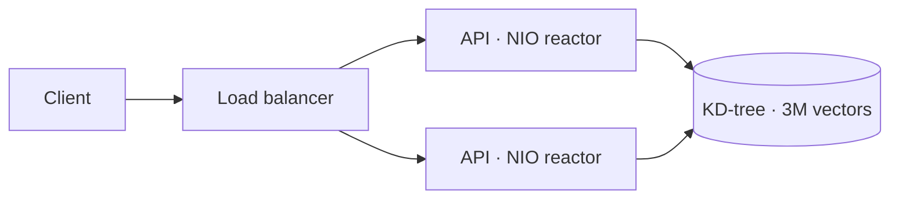

# Fraud Detection API — Rinha de Backend 2026

> Real-time card-fraud scoring built **from scratch** on Java 21 — no web framework, no JSON library, no vector-search library, **zero runtime dependencies**. A single-threaded NIO server answers every transaction with an **exact** nearest-neighbour search over ~3 million reference vectors, compiled to a **GraalVM native image** and tuned to run inside **1 CPU / 350 MB**.


**Official preview on the reference hardware (Late-2014 Mac Mini):**

- 🎯 **Zero detection errors** — `E = 0` (FP = 0 / FN = 0): every transaction scored exactly like the official reference.
- ⚡ **p99 ≈ 1.8 ms** end-to-end, through the load balancer.
- 📦 **Within budget** — load balancer + 2 API instances in **1 CPU / 350 MB**, with zero runtime dependencies.
- 🏆 **Score ≈ 5739.**

---

## The challenge

[Rinha de Backend 2026](https://github.com/zanfranceschi/rinha-de-backend-2026) is a Brazilian backend-performance competition. This edition is a **fraud-detection** problem solved with **vector search**: for every card transaction, project it into a **14-dimensional vector**, find its **5 nearest neighbours** among **~3,000,000** labelled reference vectors, and **approve** it when fewer than 60 % of those neighbours are fraudulent.

The catch is the budget: the entire stack must run in **1 CPU and 350 MB of RAM**, with **≥ 2 API instances** behind a load balancer. Scoring rewards **detection accuracy** (a wrong answer costs points; an HTTP error costs the most) and **tail latency** (a p99 ≤ 1 ms hits the ceiling).

**API** (port `9999`):

| Method | Path | Response |
| --- | --- | --- |
| `GET` | `/ready` | `200` once the dataset is loaded |
| `POST` | `/fraud-score` | `{ "approved": <bool>, "fraud_score": <float> }` |

## How it works



- **Hand-rolled I/O** — a single-threaded `java.nio` reactor with a byte-level HTTP/JSON parser. No framework, and no allocations on the hot path.
- **Exact search** — a balanced **KD-tree** with branch-and-bound returns the *true* 5 nearest neighbours, so detection matches the reference implementation exactly (`E = 0`) — no approximation.
- **Native + AOT** — compiled with **GraalVM Native Image + PGO**: a small binary with no JVM warm-up.
- **Rust hot-path** — the load-balancer/forwarder and the distance kernel have a Rust implementation, byte-identical to the Java version.

## Quickstart

```bash
# build the service (Java 21)
cd api && ./mvnw clean package -DskipTests

# or run the full stack the way the competition does — load balancer + 2 instances:
docker compose up -d
curl -s localhost:9999/ready          # => 200 once the dataset is loaded
```

Then `POST` a transaction to `/fraud-score` and get back `{"approved": …, "fraud_score": …}`. The full request example and the engineering deep-dive live in **[docs/ARCHITECTURE.md](docs/ARCHITECTURE.md)**.

## Repository

```
api/          # the Java service — NIO server, JSON parser, KD-tree search, native build
lapada/       # Rust L4 load-balancer / forwarder
rust-engine/  # Rust search kernel (hot-path)
docs/         # architecture notes and hands-on build tutorials
```

## Tech stack

**Java 21 LTS** · **GraalVM Native Image + PGO** · `java.nio` single-threaded reactor · **Rust** hot-path · Maven · **zero runtime dependencies**.

## License & author

MIT © 2026 **[@arthurd3](https://github.com/arthurd3)** — built for **[Rinha de Backend 2026](https://github.com/zanfranceschi/rinha-de-backend-2026)**.
